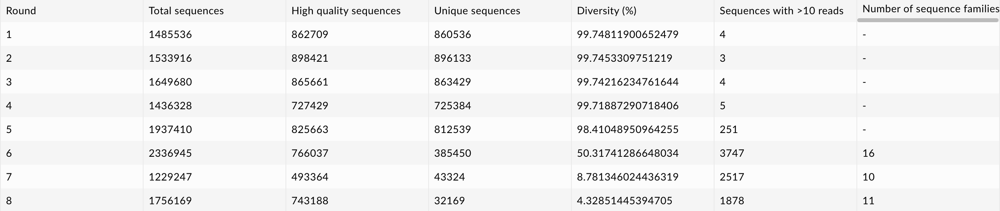

# Notes

#### Analysis Scripts

1. merge paired reads for each round using FLASh (see supplement of [this PNAS paper][2])<br>
<b>Note:</b> reads were not merged in the original analysis and only the forward reads were used in the original analysis workflow (see 0010\_qc\_slx.py from the original analysis code)
2. combine merged read files with the unmerged forward read files using BASH<br>
<b>Note:</b> reverse reads are lower quality and typically do not pass filtering by quality or structure.
<b>To-do:</b> update scripts to reflect the workflow step order change.
3. filter reads by quality (AVGQUAL:30) and remove detected adapter content using Trimmomatic<br>
<b>Note:</b> the quality filtering is similar in approach as the original analysis (see 0010\_qc\_slx.py from the original analysis code).
4. filter reads by structure to keep only those that contain the expected constant up- and down-stream regions (with 40 bp in-between in this workflow, but not the original) using BASH ({N}CGGTAGGTCCCTTAGCCAAAAAAGGACAGCG{40}CGCTGTCCGT{M})<br>
<b>Note:</b> the defined start sequence was "ACGGACAGCG" and the end sequence was "CGCTGTCCTTTTTTGGCTAAGGGACCTACCG". Additionally, it is recommended to simply reverse complement the constant regions instead of all reads, at this stage in the analysis (see 0010\_qc\_slx.py from the original analysis code).
5. clean reads to retain only the 40 bp in-between region and reverse complmenet the sequences using BASH<br>
<b>Note:</b> there does not appear to be a filter in the original analysis to keep reads that are only 40-bp in the original analysis workflow.
6. remove sequences that appear less than 10 times (see 0015\_g10\_seqs.py from the original analysis code) and re-format reads and headers using BASH<br>
<b>Note:</b> only unique reads were kept in this analysis and the sequence headers were updated to contain the run name, arbitrary sequence ID, and read counts for the unique sequence.
7. cluster read sequences for each round (run) using CD-HIT or Clustal Omega<br>
    <b>07a.</b>  cluster with a soft maximum of 500 sequences in sub-clusters (cluster-size=500), which is what the original analysis used (see 0020\_cluster\_slxn.py from the original analysis code)<br>
    <b>07b.</b>  cluster with the default soft maximum of 100 sequences in sub-clusters (see [Clustal Omega README][3])
8. create tables with the cluster sequences and peak sequences, in addition to the cluster and sequence information (run name, sequence ID, read counts, cluster ID, sequence counts, reverse complimented sequence)
9. create tables with the statistics (average, standard deviation, highest, lowest) for the percent identity of cluster sequences relative to the peak sequence within each cluster (see the JAX's [Introduction to Sequence Comparison][4])
10. create tables with counts of the number of sequences in each round 8 cluster sequence family across sequencing rounds
11. create tables with counts of the number of sequences shared across sequencing rounds for:<br>
    <b>11a.</b> all sequences that appear at least 10 times per round<br>
    <b>11b.</b> the top 10 sequences per round

<b>Note</b> that the 00a\_qc.sh script can be used to assess the quality of the fastq data after the 01\_merged, 02\_trimmed, and 03\_filtered stages. The 00b\_analyze.sh script can be used to assess the resulting fasta data from the 01\_merged, 02\_trimmed, 03\_filtered, 04\_cleaned, 05\_combined, and 06\_formatted stages.

### Data Visualization Workflow Steps

The following steps were taken to reproduce tables and plots from the slides (see the "For Elizabeth\_Population dynamics during RNA evolution.pptx" file) and additional interesting tables and plots.

<b>Note:</b> the round 8 cluster sequence families include sequences at least 90 percent identical to the cluster peak (see the 09\_identify.sh script).

#### Plotting Scripts

1. create a line plot with the percent unique sequences (see slide 4)
2. create line plots with the round 8 cluster sequence family counts and abundances (see slide 4)
3. create hetamaps with the round 8 cluster sequence family counts and abundances (expanding on slide 4)
4. create hetamaps with the log counts for the top10 sequences per round (see slide 5)
5. create hetamaps with the log counts for all sequences that appear at least 10 times per round (expanding on slide 5)
6. create hetamaps with the round 8 cluster sequence family base conservation with the substrate 3' overhang bases highlighted (see slide 6)
7. create heatmaps with the base conservation of the substrate 3' overhang for all sequences that appear at least 10 times per round (see slide 7)
8. create line plots with the summed counts and abundances of the top 10 sequences per round (expanding on slide 5)
9. create heatmaps with the round 8 cluster sequence family stem base pairing conservation (see slide 8)
10. create sequence logos with the round 8 cluster family sequences
11. create combined plots with the sequence logos, base conservation heatmap, and stem base pairing conservation heatmaps for the round 8 cluster family sequences

<b>Note:</b> the sequence data analysis plots with the round 8 cluster sequence families were produced from stage 07a. Additionally, the 00a\_cluster\_sequence\_identity.R and 00b\_cluster\_sequence\_identity.R scripts can be used to analyze the percent identities across clusters from stages 07a and 07b respectively.

#### Progress of selection across eight rounds (25 April 2025)

| Statistic | Round 1 | Round 2 | Round 3 | Round 4 | Round 5 | Round 6 | Round 7 | Round 8 |
| --- | --- | --- | --- | --- | --- | --- | --- | --- |
| Reaction Time (min)| 120 | 60 | 30 | 20 | 30 | 10 | 10 |10 |
| \[Mg<sup>2+</sup>] (mM) | 20 | 20 | 20 | 20 | 20 | 20 | 10 | 5 |
| Total Raw Reads | 1,485,536 | 1,533,916 | 1,649,680 | 1,436,328 | 1,937,410 | 2,336,945 | 1,229,247 | 1,756,169 |
| High Quality Reads | 1,039,660 | 1,067,585 | 1,033,048 | 866,423 | 981,844 | 916,485 | 582,260 | 889,374 |
| Unique Sequences | 1,036,229 | 1,063,996 | 1,029,483 | 863,123 | 966,495 | 500,507 | 92,366 | 108,529 |
| Percent Diversity | 99.67 | 99.66 | 99.65 | 99.62 | 98.44 | 54.61 | 15.86 | 12.20 |
| Sequences with > 2 Reads | 18 | 19 | 26 | 27 | 1,585 | 10,626 | 7,230 | 6,315 |

#### Supplemental

##### Table 1

| Step | Analysis | Method |
| --- | --- | --- |
|  1 | Merge the paired-end RNA sequencing reads for each round | FLASh |
|  2 | Combine the merged read files with the unmerged forward read files | BASH |
|  3 | Filter reads by quality and remove any detected adapter content | Trimmomatic |
|  4 | Filter reads by structure to keep only those that contain the expected constant up- and down-stream regions with 40 bp in-between | BASH |
|  5 | Clean reads to retain only the 40 bp in-between region | BASH |
|  6 | Filter to keep unique sequences | BASH |
|  7 | Cluster the unique sequences for each round | Clustal Omega |

##### Table 2

| family_ID | seq_counts | read_counts | read_abun | sequence |
| 1 | 1460 | 324773 | 36.5170333290607 | GAATGCTGCCAACCGTGCGGGCTAATTGGCAGACTGAGCT |
| 2 | 264 | 91636 | 10.3034269047667 | CCTAGCTAGCGCTGACTAGGACAGATGAGCGGCGGAACCA |
| 3 | 176 | 47376 | 5.32689284822808 | TTAGTGAAATTGGTGCCCAAGCAGAGAATTGGGATAAATC |
| 4 | 141 | 37250 | 4.18833921387403 | GAACCCTTATCACAGTCGTGCGGATTTGTAAGCCTAAGCG |
| 5 | 128 | 29264 | 3.29040426187408 | AGAGACCGTGAGCTTGCGGAATGTTAGCAGAACAGAACTG |
| 6 | 113 | 17774 | 1.99848432717844 | AGCCACTGCGGAAGACCTTAAGAGGTGTAATTGCTCACCC |
| 7 | 112 | 16553 | 1.86119675187267 | AAAAGTTTCGCTGAATTGGACAGACCACCGCGTGAAGTGG |
| 8 | 87 | 9579 | 1.07704970012616 | CCGGTCTTAAGCCCCTGCGTTGCGGAAATGCACGTTGCCC |
| 9 | 87 | 7336 | 0.824849838200802 | GACGGACGGTCGCGGTAACCTATGACCATGAGACGGAACA |
| 10 | 67 | 4539 | 0.510358971591254 | TGATGAATCGGCATACGTGGGTCAGAGTCATAGTGCGACA |

##### Table 3

| sequence | Round1 | Round2 | Round3 | Round4 | Round5 | Round6 | Round7 | Round8 |
| GAATGCTGCCAACCGTGCGGGCTAATTGGCAGACTGAGCT | 1 | 1 | 1 | 1 | 2 | 1 | 1 | 1 |
| TTAGTGAAATTGGTGCCCAAGCAGAGAATTGGGATAAATC | 2 | 2 | 3 | 2 | 1 | 2 | 2 | 3 |
| CCTAGCTAGCGCTGACTAGGACAGATGAGCGGCGGAACCA | 3 | 3 | 2 | 3 | 4 | 6 | 4 | 2 |
| GAACCCTTATCACAGTCGTGCGGATTTGTAAGCCTAAGCG | 4 | 5 | 7 | 9 | 10 | 9 | 7 | 4 |
| CTGGCAAACACAGCGCGCTGTGTGTTATGTGGGGCGGTCT | 5 | 4 | 5 | 6 | 5 | 3 | 3 | 9 |
| TCAGTCGGAGTACCAGAGCGATAGACGTCCCCGGAAGCCG | 6 | 7 | 4 | 7 | 6 | 4 | 6 | 10 |
| AGAGACCGTGAGCTTGCGGAATGTTAGCAGAACAGAACTG | 7 | 8 | 8 | 4 | NA | NA | 9 | 5 |
| TTGGTGTAGAGCGCCAACTGGACAGACCTTACGGAAACGG | 8 | 6 | 10 | 5 | 3 | 5 | 5 | NA |
| GACGGACGGTCGCGGTAACCTATGACCATGAGACGGAACA | 9 | NA | NA | NA | 7 | NA | 8 | NA |
| TGTCGTTGAGATATACTGGACAGACAAGACGTGGGAACTG | 10 | NA | NA | NA | NA | 7 | 10 | NA |
| TGATGAATCGGCATACGTGGGTCAGAGTCATAGTGCGACA | NA | 9 | NA | NA | NA | NA | NA | NA |
| TGATCGGCAACCGTGGTATAAGTTCACAATGTGCGGCAGG | NA | 10 | NA | NA | 9 | NA | NA | NA |
| TTAGAGAGCCACATGCGCTCTGTTTTGCGGATAAAATGTG | NA | NA | 6 | 8 | NA | NA | NA | NA |
| AATTACCTGCCCATGTGCTGAATGCAGCGAAATCATCGAA | NA | NA | 9 | NA | NA | NA | NA | NA |
| AGCCACTGCGGAAGACCTTAAGAGGTGTAATTGCTCACCC | NA | NA | NA | 10 | NA | NA | NA | 6 |
| CGCAGCGCTCACCTTGAGAGGTCAGAAAAGATGTTGAATA | NA | NA | NA | NA | 8 | 8 | NA | NA |
| GAATGCGTCCACTTGCGGGCACAAACTCGACGACTGAGCA | NA | NA | NA | NA | NA | 10 | NA | NA |
| AAAAGTTTCGCTGAATTGGACAGACCACCGCGTGAAGTGG | NA | NA | NA | NA | NA | NA | NA | 7 |
| GAATGCTACCAACCGTGCGGGCTAATTGGCAGACTGAGCT | NA | NA | NA | NA | NA | NA | NA | 8 |

#### Progress Assessment
For analysis steps 01 to 07 use BASH to:<br>
<b>00a.</b>  create QC reports for each set of raw and processed data using FastQC and MultiQC<br>
<b>00b.</b>  analyze read numbers, read lengths, counts of unique reads, and counts of read names

#### Progress of selection across eight rounds (17 April 2025)

| | Round 1 | Round 2 | Round 3 | Round 4 | Round 5 | Round 6 | Round 7 | Round 8 |
| --- | --- | --- | --- | --- | --- | --- | --- | --- | --- |
| Reaction Time (min)| 120 | 60 |30 | 20 | 30 | 10 | 10 |10 |
| \[Mg<sup>2+</sup>] (mM) | 20 | 20 | 20 | 20 | 20 | 20 | 10 | 5 |
| Total Raw Reads | 1,485,536 | 1,533,916 | 1,649,680 | 1,436,328 | 1,937,410 | 2,336,945 | 1,229,247 | 1,756,169 |
| High Quality Reads | 1,039,660 | 1,067,585 | 1,033,048 | 866,423 | 981,844 | 916,485 | 582,260 | 889,374 |
| Unique Sequences | 1,036,229 | 1,063,996 | 1,029,483 | 863,123 | 966,495 | 500,507 | 92,366 | 108,529 |
| Percent Diversity | 99.67 | 99.66 | 99.65 | 99.62 | 98.44 | 54.61 | 15.86 | 12.20 |
| Sequences with > 2 Reads | 18 | 19 | 26 | 27 | 1,585 | 10,626 | 7,230 | 6,315 |
| Sequence Families | NA | NA | NA | NA | 2 | 17 | 14 | 10 |

#### Progress of selection across eight rounds (27 March 2025)

| <div style="width:175px">Statistic</div> | <b>Round 1</b> | <b>Round 2</b> | <b>Round 3</b> | <b>Round 4</b> | <b>Round 5</b> | <b>Round 6</b> | <b>Round 7</b> | <b>Round 8</b> |
| --- | --- | --- | --- | --- | --- | --- | --- | --- | --- |
| Reaction Time (min)| 120 | 60 |30 | 20 | 30 | 10 | 10 |10 |
| \[Mg<sup>2+</sup>] (mM) | 20 | 20 | 20 | 20 | 20 | 20 | 10 | 5 |
| Total Raw Reads | 1,485,536 | 1,533,916 | 1,649,680 | 1,436,328 | 1,937,410 | 2,336,945 | 1,229,247 | 1,756,169 |
| High Quality Reads | 1,039,660 | 1,067,585 | 1,033,048 | 866,423 | 981,844 | 916,485 | 582,260 | 889,374 |
| Unique Reads | 1,036,229 | 1,063,996 | 1,029,483 | 863,123 | 966,495 | 500,507 | 92,366 | 108,529 |
| Diversity (%) | 99.67 | 99.66 | 99.65 | 99.62 | 98.44 | 54.61 | 15.86 | 12.20 |
| Sequences with > 2 Reads | 18 | 19 | 26 | 27 | 1,585 | 10,626 | 7,230 | 6,315 |
| Sequence Families (Sequences with > 2 Reads) | NA | NA | NA | NA | 2 | 17 | 14 | 10 |

#### Progress of selection across eight rounds (2 March 2025)

| Round 1 | Round 2 | Round 3 | Round 4 | Round 5 | Round 6 | Round 7 | Round 8 |
| --- | --- | --- | --- | --- | --- | --- | --- | --- | --- |
| Reaction Time (min)| 120 | 60 |30 | 20 | 30 | 10 | 10 |10 |
| \[Mg<sup>2+</sup>] (mM) | 20 | 20 | 20 | 20 | 20 | 20 | 10 | 5 |
| Total Raw Reads | 1,485,536 | 1,533,916 | 1,649,680 | 1,436,328 | 1,937,410 | 2,336,945 | 1,229,247 | 1,756,169 |
| High Quality Reads | 1,039,660 | 1,067,585 | 1,033,048 | 866,423 | 981,844 | 916,485 | 582,260 | 889,374 |
| Unique Sequences | 1,036,229 | 1,063,996 | 1,029,483 | 863,123 | 966,495 | 500,507 | 92,366 | 108,529 |
| Percent Diversity | 99.67 | 99.66 | 99.65 | 99.62 | 98.44 | 54.61 | 15.86 | 12.20 |
| Sequence Families | 3019 | 3078 | 2953 | 2549 | 2730 | 1638 | 373 | 402 |

#### Progress of selection across eight rounds (12 January 2025)

| <div style="width:175px">Statistic</div> | <b>Round 1</b> | <b>Round 2</b> | <b>Round 3</b> | <b>Round 4</b> | <b>Round 5</b> | <b>Round 6</b> | <b>Round 7</b> | <b>Round 8</b> |
| --- | --- | --- | --- | --- | --- | --- | --- | --- | --- |
| Reaction Time (min)| 120 | 60 |30 | 20 | 30 | 10 | 10 |10 |
| \[Mg<sup>2+</sup>] (mM) | 20 | 20 | 20 | 20 | 20 | 20 | 10 | 5 |
| Total Raw Reads | 1,485,536 | 1,533,916 | 1,649,680 | 1,436,328 | 1,937,410 | 2,336,945 | 1,229,247 | 1,756,169 |
| High Quality Reads | 1,039,660 | 1,067,585 | 1,033,048 | 866,423 | 981,844 | 916,485 | 582,260 | 889,374 |
| Unique Reads | 1,036,229 | 1,063,996 | 1,029,483 | 863,123 | 966,495 | 500,507 | 92,366 | 108,529 |
| Diversity (%) | 99.67 | 99.66 | 99.65 | 99.62 | 98.44 | 54.61 | 15.86 | 12.20 |
| Sequences with > 9 Reads | 5 | 3 | 5 | 4 | 283 | 4,001 | 2,703 | 2,100 |
| Sequence Families | NA | NA | NA | NA | NA | 16 | 14 | 13 |

#### Analysis Workflow Progress - Sequence Statistics (28 October 2024)

| | Statistic | Round 1 | Round 2 | Round 3 | Round 4 | Round 5 | Round 6 | Round 7 | Round 8 | Doped 1 | Doped 2 | Doped 3 |
| --- | --- | --- | --- | --- | --- | --- | --- | --- | --- | --- | --- | --- |
| A | Reaction Time (min)| 120 | 60 |30 | 20 | 30 | 10 | 10 |10 | --- | --- | --- |
| B | [Mg<sup>2+</sup>] (mM) | 20 | 20 | 20 | 20 | 20 | 20 | 10 | 5 | --- | --- | --- |
| C | Total Raw Reads | 1,485,536 | 1,533,916 | 1,649,680 | 1,436,328 | 1,937,410 | 2,336,945 | 1,229,247 | 1,756,169 | 1,226,539 | 1,090,909 | 1,656,088 |
| D | High Quality Reads | 1,039,660 | 1,067,585 | 1,033,048 | 866,423 | 981,844 | 916,485 | 582,260 | 889,374 | 865,509 | 807,849 | 1,143,871 |
| E | Unique Reads | 1,036,229 | 1,063,996 | 1,029,483 | 863,123 | 966,495 | 500,507 | 92,366 | 108,529 | 842,149 | 746,445 | 988,626 |
| F | Diversity (%) | 99.67 | 99.66 | 99.65 | 99.62 | 98.44 | 54.61 | 15.86 | 12.20 | 97.30 | 92.40 | 86.43 |
| G | Sequences with > 9 Reads | 5 | 3 | 5 | 4 | 283 | 4,001 | 2,703 | 2,100 | 62 | 749 | 1,690 |
| H | Sequence Families | NA | NA | NA | NA | NA | 16 | 14 | 13 | NA | 4 | 6 |

##### Additional Analysis Results
| | Statistic | R1 | R2 | R3 | R4 | R5 | R6 | R7 | R8 | D1 | D2 | D3 |
| --- | --- | --- | --- | --- | --- | --- | --- | --- | --- | --- | --- | --- |
| G | Sequence Families (100) | NA | NA | NA | NA | 7 | 68 | 45 | 41 | NA | 12 | 27 |

#### qc\_statistics\_table - from original code repository data directory



<b>Note:</b> the number of "Sequences with >10 reads" is actually the number of sequences with greater than 9 reads (see 0015\_g10\_seqs.py from the original analysis code).

#### Progress of in vitro selection - from original slides


##### Table Data Description
- Total: the number of raw read sequences in either (not both) the forward or reverse read file
- Quality: the number of sequences that passed quality filtering and contain the expected start and end patterns 
- Unique: the number of unique sequences that passed quality filtering and contain the expected start and end patterns
- Diversity%: the percentage of "Unique" sequences contained in the "Quality" sequences
- Families(500): the number of clustered sequence families with the original soft maximum of 500 sequences in sub-clusters
- Families(100): the number of clustered sequence families with the default soft maximum of 100 sequences in sub-clusters

## Step 09 - Quantified
### Sequences with Above 2 Reads
Re-run the following:
    64 /scratch365/ebrooks5/RNA_evolution/outputs/09b_quantified_above2/r5_S5_L001_in_r1_S1_L001_counts_plot_table.csv
     2 /scratch365/ebrooks5/RNA_evolution/outputs/09b_quantified_above2/r5_S5_L001_in_r4_S4_L001_counts_plot_table.csv
     48 /scratch365/ebrooks5/RNA_evolution/outputs/09b_quantified_above2/r6_S6_L001_in_r2_S2_L001_counts_plot_table.csv
     17 /scratch365/ebrooks5/RNA_evolution/outputs/09b_quantified_above2/r6_S6_L001_in_r4_S4_L001_counts_plot_table.csv
      2 /scratch365/ebrooks5/RNA_evolution/outputs/09b_quantified_above2/r6_S6_L001_in_r5_S5_L001_counts_plot_table.csv
     34 /scratch365/ebrooks5/RNA_evolution/outputs/09b_quantified_above2/r6_S6_L001_in_r7_S7_L001_counts_plot_table.csv
      2 /scratch365/ebrooks5/RNA_evolution/outputs/09b_quantified_above2/r6_S6_L001_in_r8_S8_L001_counts_plot_table.csv
     76 /scratch365/ebrooks5/RNA_evolution/outputs/09b_quantified_above2/r7_S7_L001_in_r1_S1_L001_counts_plot_table.csv
      2 /scratch365/ebrooks5/RNA_evolution/outputs/09b_quantified_above2/r7_S7_L001_in_r6_S6_L001_counts_plot_table.csv
     32 /scratch365/ebrooks5/RNA_evolution/outputs/09b_quantified_above2/r8_S8_L001_in_r4_S4_L001_counts_plot_table.csv
      2 /scratch365/ebrooks5/RNA_evolution/outputs/09b_quantified_above2/r8_S8_L001_in_r6_S6_L001_counts_plot_table.csv


## Progress of in vitro selection - Update (14 October 2024)

| Stat | R1 | R2 | R3 | R4 | R5 | R6 | R7 | R8 | D1 | D2 | D3 |
| --- | --- | --- | --- | --- | --- | --- | --- | --- | --- | --- | --- |
| Total | 1,485,536 | 1,533,916 | 1,649,680 | 1,436,328 | 1,937,410 | 2,336,945 | 1,229,247 | 1,756,169 | 1,226,539 | 1,090,909 | 1,656,088 |
| Quality | 632,019 | 638,186 | 622,607 | 532,376 | 609,626 | 572,035 | 353,891 | 558,886 | 524,920 | 484,648 | 698,698 |
| Unique | 631,112 | 637,228 | 621,664 | 531,469 | 603,425 | 360,806 | 103,259 | 149,949 | 517,947 | 458,560 | 632,000 |
| Diversity% | 99.8565 | 99.8499 | 99.8485 | 99.8296 | 98.9828 | 63.0741 | 29.1782 | 26.8300 | 98.6716 | 94.6171 | 90.4540 |
| Families | N/A | N/A | N/A | N/A | N/A | 3,433 | 1,814 | 1,006 | N/A | N/A | N/A |


### Step 02 - Combined

| Stat | R1 | R2 | R3 | R4 | R5 | R6 | R7 | R8 | D1 | D2 | D3 |
| --- | --- | --- | --- | --- | --- | --- | --- | --- | --- | --- | --- |
| Total | 1,485,536 | 1,533,916 | 1,649,680 | 1,436,328 | 1,937,410 | 2,336,945 | 1,229,247 | 1,756,169 | 1,226,539 | 1,090,909 | 1,656,088 |
| Quality | 1869328 | 1882973 | 2074627 | 1726395 | 2416855 | 2896900 | 1489558 | 2240022 | 1553656 | 1337026 | 2077312 |
| Unique | 1657227 | 1712138 | 1813249 | 1612688 | 2115472 | 1709142 | 549695 | 751481 | 1388018 | 1217610 | 1744650 |
| Diversity% | R1 | R2 | R3 | R4 | R5 | R6 | R7 | R8 | D1 | D2 | D3 |
| Families | N/A | N/A | N/A | N/A | N/A | R6 | R7 | R8 | N/A | N/A | N/A |

### Step 03 - Filtered

| Stat | R1 | R2 | R3 | R4 | R5 | R6 | R7 | R8 | D1 | D2 | D3 |
| --- | --- | --- | --- | --- | --- | --- | --- | --- | --- | --- | --- |
| Total | 1,485,536 | 1,533,916 | 1,649,680 | 1,436,328 | 1,937,410 | 2,336,945 | 1,229,247 | 1,756,169 | 1,226,539 | 1,090,909 | 1,656,088 |
| Quality | 1265458 | 1278170 | 1247279 | 1067052 | 1222207 | 1147067 | 708882 | 1118288 | 1050290 | 969677 | 1398173 |
| Unique | 1262333 | 1274868 | 1244065 | 1063950 | 1207611 | 737192 | 220609 | 318830 | 1028429 | 912335 | 1256095 |
| Diversity% | R1 | R2 | R3 | R4 | R5 | R6 | R7 | R8 | D1 | D2 | D3 |
| Families | N/A | N/A | N/A | N/A | N/A | R6 | R7 | R8 | N/A | N/A | N/A |

### Step 04 - Cleaned

| Stat | R1 | R2 | R3 | R4 | R5 | R6 | R7 | R8 | D1 | D2 | D3 |
| --- | --- | --- | --- | --- | --- | --- | --- | --- | --- | --- | --- |
| Total | 1,485,536 | 1,533,916 | 1,649,680 | 1,436,328 | 1,937,410 | 2,336,945 | 1,229,247 | 1,756,169 | 1,226,539 | 1,090,909 | 1,656,088 |
| Quality | 632,019 | 638,186 | 622,607 | 532,376 | 609,626 | 572,035 | 353,891 | 558,886 | 524,920 | 484,648 | 698,698 |
| Unique | 631,112 | 637,228 | 621,664 | 531,469 | 603,425 | 360,806 | 103,259 | 149,949 | 517,947 | 458,560 | 632,000 |
| Diversity% | 99.8565 | 99.8499 | 99.8485 | 99.8296 | 98.9828 | 63.0741 | 29.1782 | 26.8300 | 98.6716 | 94.6171 | 90.4540 |
| Families | N/A | N/A | N/A | N/A | N/A | 678,919 | 173,591 | 262,776 | N/A | N/A | N/A |

### Step 05 - Formatted

| Stat | R1 | R2 | R3 | R4 | R5 | R6 | R7 | R8 | D1 | D2 | D3 |
| --- | --- | --- | --- | --- | --- | --- | --- | --- | --- | --- | --- |
| Total | 1,485,536 | 1,533,916 | 1,649,680 | 1,436,328 | 1,937,410 | 2,336,945 | 1,229,247 | 1,756,169 | 1,226,539 | 1,090,909 | 1,656,088 |
| Quality | 63 | 52 | 64 | 46 | 3301 | 201922 | 245066 | 403335 | 992 | 17480 | 46229 |
| Unique | 5 | 3 | 5 | 5 | 262 | 3827 | 2574 | 2008 | 57 | 679 | 1568 |
| Diversity% | R1 | R2 | R3 | R4 | R5 | R6 | R7 | R8 | D1 | D2 | D3 |
| Families | N/A | N/A | N/A | N/A | N/A | 3433 | 1814 | 1006 | N/A | N/A | N/A |

## Progress of in vitro selection - Update (12 September 2024)

To count read names:
for i in /Users/bamflappy/PfrenderLab/RNA_evolution/outputs/\*/\*\.fq; do echo \$i; cat $i | awk 'NR%4==1' | wc -l; done
for i in /Users/bamflappy/PfrenderLab/RNA_evolution/outputs/\*/\*\.fa; do echo \$i; cat $i | awk 'NR%2==1' | wc -l; done

To filter sequences by structure and count read names:
for i in /Users/bamflappy/PfrenderLab/RNA_evolution/outputs/combined/\*\.fq; do echo \$i; cat \$i | grep -Ex -B1 '.\*GGACAGCG.{40}CGCTGTCC.\*' | sed "s/^.\*GGACAGCG//g" | sed "s/CGCTGTCC.\*\$//g" | grep -Ex -B1 '.{40}' | grep -v "^--$" | awk 'NR%2==1 | wc -l; done

### Run Stats

| Stat | R1 | R2 | R3 | R4 | R5 | R6 | R7 | R8 | D1 | D2 | D3 |
| --- | --- | --- | --- | --- | --- | --- | --- | --- | --- | --- | --- |
| RawForward | 1485536 | 1533916 | 1649680 | 1436328 | 1937410 | 2336945 | 1229247 | 1756169 | 1226539 | 1090909 | 1656088 |
| RawReverse | 1485536 | 1533916 | 1649680 | 1436328 | 1937410 | 2336945 | 1229247 | 1756169 | 1226539 | 1090909 | 1656088 |
| TrimmedPF | 1484182 | 1532658 | 1648235 | 1435225 | 1935700 | 2334968 | 1228211 | 1754397 | 1225204 | 1089533 | 1654299 |
| TrimmedPR | 1484182 | 1532658 | 1648235 | 1435225 | 1935700 | 2334968 | 1228211 | 1754397 | 1225204 | 1089533 | 1654299 |
| TrimmedUF | 1285 | 1196 | 1394 | 1050 | 1632 | 1884 | 976 | 1697 | 1297 | 1352 | 1738 |
| FilteredTUF | 113 | 116 | 207 | 140 | 158 | 113 | 86 | 163 | 186 | 346 | 229 |
| TrimmedUR | 60 | 60 | 48 | 51 | 70 | 85 | 54 | 71 | 38 | 21 | 48 |
| FilteredTUR | 11 | 11 | 12 | 7 | 8 | 24 | 6 | 11 | 5 | 2 | 4 |
| Merged | 913620 | 987397 | 1025706 | 951001 | 1204610 | 1472342 | 799622 | 1049155 | 663634 | 619174 | 911598 |
| FilteredM | 794411 | 824063 | 793456 | 693163 | 767847 | 715212 | 453821 | 697759 | 606866 | 561247 | 810341 |
| UnMergedF | 570562 | 545261 | 622529 | 484224 | 731090 | 862626 | 428589 | 705242 | 561570 | 470359 | 742701 |
| FilteredUMF | 122141 | 128749 | 124080 | 107368 | 125311 | 112480 | 75136 | 115697 | 187021 | 179105 | 246300 |
| UnMergedR | 570562 | 545261 | 622529 | 484224 | 731090 | 862626 | 428589 | 705242 | 561570 | 470359 | 742701 |
| FilteredUMR | 119435 | 118315 | 113713 | 101266 | 109282 | 103501 | 63748 | 100765 | 154110 | 141484 | 205815 |
| FilteredCombined | 1036111 | 1071254 | 1031468 | 901944 | 1002606 | 931330 | 592797 | 914395 | 948188 | 882184 | 1262689 |
| Combined | 2056029 | 2079115 | 2272158 | 1920499 | 2668422 | 3199478 | 1657776 | 2461336 | 1788071 | 1561244 | 2398738 |
| CombinedFiltered | 1036100 | 1071243 | 1031456 | 901937 | 1002598 | 931306 | 592791 | 914384 | 948183 | 882182 | 1262685 |

### Combined Reads - Filtered by Structure

To count unique read sequences:
for i in /Users/bamflappy/PfrenderLab/RNA_evolution/outputs/\*/\*\.fq; do echo \$i; cat $i | awk 'NR%4==0' | sort -u | wc -l; done
for i in /Users/bamflappy/PfrenderLab/RNA_evolution/outputs/\*/\*\.fa; do echo \$i; cat $i | awk 'NR%2==0' | sort -u | wc -l; done

To count unique read names:
for i in /Users/bamflappy/PfrenderLab/RNA_evolution/outputs/\*/\*\.fq; do echo \$i; cat $i | awk 'NR%4==1' | cut -d' ' -f1 | sort -u | wc -l; done
for i in /Users/bamflappy/PfrenderLab/RNA_evolution/outputs/\*/\*\.fa; do echo \$i; cat $i | awk 'NR%2==1' | cut -d' ' -f1 | sort -u | wc -l; done

| Stat | R1 | R2 | R3 | R4 | R5 | R6 | R7 | R8 | D1 | D2 | D3 |
| --- | --- | --- | --- | --- | --- | --- | --- | --- | --- | --- | --- |
| Total | 1,485,536 | 1,533,916 | 1,649,680 | 1,436,328 | 1,937,410 | 2,336,945 | 1,229,247 | 1,756,169 | 1,226,539 | 1,090,909 | 1,656,088 |
| Quality | 1,036,111 | 1,071,254 | 1,031,468 | 901,944 | 1,002,606 | 931,330 | 592,797 | 914,395 | 948,188 | 882,184 | 1,262,689 |
| Unique | 1,033,568 | 1,068,568 | 1,028,855 | 899,424 | 988,146 | 503,256 | 82,177 | 74,546 | 929,757 | 824,867 | 1,114,276 |
| Diversity% | 100 | 100 | 100 | 100 | 99 | 54 | 14 | 0.1 | 98 | 94 | 88 |
| Families | N/A | N/A | N/A | N/A | N/A | R6 | R7 | R8 | N/A | N/A | N/A |

## Progress of in vitro selection - Update (30 August 2024)

### Run Stats

| Stat | R1 | R2 | R3 | R4 | R5 | R6 | R7 | R8 | D1 | D2 | D3 |
| --- | --- | --- | --- | --- | --- | --- | --- | --- | --- | --- | --- |
| RawForward | 1485536 | 1533916 | 1649680 | 1436328 | 1937410 | 2336945 | 1229247 | 1756169 | 1226539 | 1090909 | 1656088 |
| RawReverse | 1485536 | 1533916 | 1649680 | 1436328 | 1937410 | 2336945 | 1229247 | 1756169 | 1226539 | 1090909 | 1656088 |
| TrimmedForward | 1125487 | 1177286 | 1267375 | 1107470 | 1482964 | 1800051 | 945991 | 1348014 | 913723 | 812516 | 1241307 |
| TrimmedReverse | 1125487 | 1177286 | 1267375 | 1107470 | 1482964 | 1800051 | 945991 | 1348014 | 913723 | 812516 | 1241307 |
| RegionForward | 838868 | 871694 | 839359 | 728738 | 813261 | 757042 | 479992 | 736784 | 721582 | 671629 | 960867 |
| RegionReverse | 852879 | 881806 | 848978 | 743983 | 822940 | 766913 | 486182 | 748219 | 712159 | 658461 | 951936 |
| UniqueForward | 836538 | 869219 | 836906 | 726372 | 799992 | 378395 | 38617 | 28478 | 705348 | 621216 | 830676 |
| UniqueReverse | 850641 | 879552 | 846795 | 741772 | 810513 | 390711 | 46589 | 35600 | 696551 | 611718 | 828204 |

### Forward Paird Reads - Filtered by Structure

| Stat | R1 | R2 | R3 | R4 | R5 | R6 | R7 | R8 | D1 | D2 | D3 |
| --- | --- | --- | --- | --- | --- | --- | --- | --- | --- | --- | --- |
| Total | 1485536 | 1533916 | 1649680 | 1436328 | 1937410 | 2336945 | 1229247 | 1756169 | 1226539 | 1090909 | 1656088 |
| Quality | 1125487 | 1177286 | 1267375 | 1107470 | 1482964 | 1800051 | 945991 | 1348014 | 913723 | 812516 | 1241307 |
| Unique | 836538 | 869219 | 836906 | 726372 | 799992 | 378395 | 38617 | 28478 | 705348 | 621216 | 830676 |
| Diversity% | 74 | 74 | 66 | 66 | 54 | 21 | 4 | 2 | 77 | 77 | 67 |
| Families | N/A | N/A | N/A | N/A | N/A | R6 | R7 | R8 | N/A | N/A | N/A |

## Check cluster numbers and sizes
```
for i in /Users/bamflappy/PfrenderLab/RNA_evolution/outputs_avg/clustered_size_500_avg/*_above10/*_clustered.aux; do echo $i; cat $i | cut -d":" -f1 | cut -d" " -f2 | sort -n | uniq -c; done
```

[1]: https://github.com/ElizabethBrooks/RNA_selection_amplification
[2]: https://doi.org/10.1073/pnas.2321592121
[3]: https://github.com/GSLBiotech/clustal-omega/blob/master/README
[4]: https://www.jax.org/-/media/jaxweb/files/education-and-learning/ttgg-seq-comparison/seqcomp_introduction.pdf?rev=93c9ff2010234a4bb0dfa0ed043de28e#:~:text=%F0%9D%91%83%F0%9D%91%92%F0%9D%91%9F%F0%9D%91%90%F0%9D%91%92%F0%9D%91%9B%F0%9D%91%A1%20%F0%9D%90%BC%F0%9D%91%91%F0%9D%91%92%F0%9D%91%9B%F0%9D%91%A1%F0%9D%91%96%F0%9D%91%A1%F0%9D%91%A6%20%3D%20%23%20%F0%9D%91%9D%F0%9D%91%9C%F0%9D%91%A0%F0%9D%91%96%F0%9D%91%A1%F0%9D%91%96%F0%9D%91%9C%F0%9D%91%9B%F0%9D%91%A0%20%E2%88%92%20%23,of%20sequences%20can%20be%20compared.
